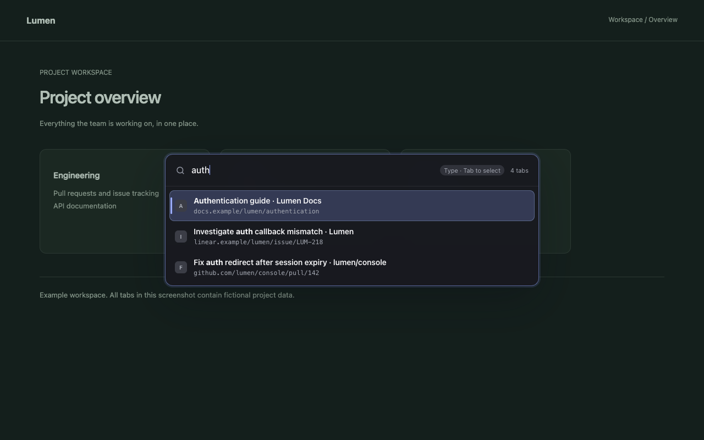

# Peek

Find an open Chrome tab without scanning the tab strip.

Press **Control+Space**, type part of a title or URL, and press **Enter** to switch. Peek searches tabs across all normal windows in your current Chrome profile.

[Download the latest release](https://github.com/KaviiSuri/peek/releases/latest) · [Report a bug](https://github.com/KaviiSuri/peek/issues) · [Privacy policy](PRIVACY.md)



*Actual extension screenshot with fictional tabs.*

## Install

Peek is currently available as an unpacked Chrome extension, not through the Chrome Web Store.

1. Download `peek-<version>.zip` from the [latest release](https://github.com/KaviiSuri/peek/releases/latest) and extract it into a folder you intend to keep.
2. Open `chrome://extensions` and turn on **Developer mode**.
3. Click **Load unpacked** and select the folder containing `manifest.json`.
4. Open `chrome://extensions/shortcuts` and check Peek's shortcut. The default is **Control+Space**, including on macOS, where it uses Control rather than Command. Choose another shortcut if it conflicts with your system.

You can also open Peek from Chrome's extensions menu or pin its toolbar icon.

To update, replace the files in your existing installation folder with the new ZIP's contents. Click **Reload** on Peek at `chrome://extensions`, then refresh open webpages.

## Keyboard controls

Peek opens in typing mode. Moving the highlight does not switch tabs.

| Key | Action |
| --- | --- |
| Control+Space | Open Peek |
| Up / Down | Move the highlight |
| Enter | Switch to the highlighted tab and its window |
| Escape | Close without switching |
| Tab | Toggle between typing and selection mode |
| j / k | Move down / up in selection mode |
| 1–9 | Switch to a numbered visible result in selection mode |

In typing mode, letters and digits are query text. Tab returns from selection mode to your query with the caret position restored.

With an empty query, Peek preselects your previously viewed tab when one is known. Open Peek and press Enter to switch back.

On regular webpages, the palette appears over the page. On restricted pages such as `chrome://settings` and the Chrome Web Store, it opens in a separate temporary window.

## Fuzzy search

Peek uses [fzf-for-js](https://github.com/ajitid/fzf-for-js), following the fzf-style matching used by Telescope's fzf-native extension. You can leave letters out, but the remaining letters must be in order.

| Query | Example |
| --- | --- |
| `gh` | Matches `GitHub` |
| `auth 142` | Matches an auth-related title with `142` in its URL |
| `142 auth` | Finds the same candidates; term order does not matter |
| `'auth` | Requires the exact substring `auth` |
| `auth !142` | Matches `auth` but excludes entries containing `142` |

Space-separated terms must all match the title or displayed URL. Lowercase terms ignore case; a term containing uppercase letters is case-sensitive. Matching characters appear in bold.

Compact matches and word starts score well. Equal scores favor shorter labels, then original tab order. Recency only orders the empty-query list, with the previous tab first and current tab last.

<details>
<summary>More search details</summary>

- `^prefix` matches the beginning, `suffix$` matches the end, and `one | another` matches either alternative.
- Prefix and suffix operators apply to the combined label: title, a space, then location.
- The location includes host, port, path, query and fragment, but excludes the URL scheme and credentials.
- Text uses NFC Unicode normalization. Accents are not stripped.
- Fuzzy matching does not correct substituted or transposed letters.

The JavaScript port is not identical to native Telescope in every detail. See the [matcher research and implementation notes](docs/discovery/telescope-fuzzy-matching.md).

</details>

## Privacy and permissions

No account, analytics, or remote search service. Peek processes tab metadata and queries locally. It does not search page contents or incognito tabs.

Peek needs `tabs` to read open-tab metadata, `activeTab` and `scripting` to show the palette when invoked, `storage` to remember current and previous tab IDs during the browser session, and `favicon` to obtain icons through Chrome's favicon service. It does not request permanent access to all websites or install an always-on keyboard listener.

Read the [privacy policy](PRIVACY.md) for storage, network and permission details.

## Known limitations

- [Very early typing can reach the page before Peek opens.](https://github.com/KaviiSuri/peek/issues/8) Input buffering is not implemented yet.
- [Some manual browser checks remain unfinished](https://github.com/KaviiSuri/peek/issues/9), including physical IME and clipboard testing. Automated checks do not replace those tests.
- If Chrome suspends the background worker while Peek is open, the session can expire. Close Peek and open it again.

## Development

Requires Node 24.15 or newer and npm 11.

```sh
git clone https://github.com/KaviiSuri/peek.git
cd peek
npm ci
npm run build
npm test
npm run typecheck
```

Load `dist/` as an unpacked extension. The code uses TypeScript, esbuild, Effect and a framework-free UI.

- [Development and browser testing](docs/development.md)
- [Tooling decisions](docs/tooling-decisions.md)
- [Technical qualification status](docs/final-technical-acceptance.md)
- [Product direction](PRODUCT.md), [specification](docs/first-release-spec.md) and [acceptance contract](docs/first-release-acceptance.md)
- [Discovery archive](docs/discovery/README.md)
- [Third-party notices](THIRD_PARTY_NOTICES.txt)
